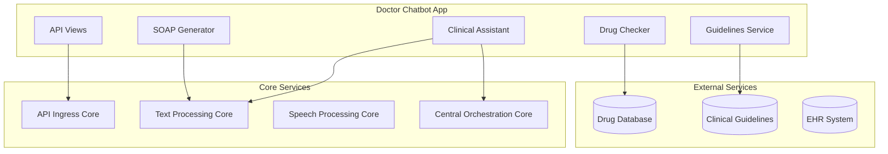

# 👨‍⚕️ پلن توسعه چت‌بات پزشک HELSSA

## 📋 خلاصه اجرایی

چت‌بات پزشک یک دستیار هوشمند برای پزشکان است که در تشخیص، تجویز دارو، مستندسازی و مدیریت ویزیت‌ها کمک می‌کند. این سیستم با استفاده از GPT-4 و دسترسی به پایگاه دانش پزشکی، پشتیبانی تصمیم‌گیری بالینی ارائه می‌دهد.

## 🎯 اهداف

1. **دستیار تشخیص**: کمک در تشخیص بر اساس علائم و نتایج آزمایش
2. **مستندسازی خودکار**: تولید گزارش SOAP و یادداشت‌های بالینی
3. **پشتیبانی تجویز**: بررسی تداخلات دارویی و دوز مناسب
4. **مدیریت ویزیت**: برنامه‌ریزی و پیگیری بیماران
5. **دسترسی به Guidelines**: ارائه آخرین راهنماهای بالینی

## 🏗️ معماری

### اتصال به هسته‌ها



### کامپوننت‌های اصلی

1. **Clinical Assistant**: دستیار تشخیص و درمان
2. **SOAP Generator**: تولید گزارش‌های استاندارد
3. **Drug Interaction Checker**: بررسی تداخلات دارویی
4. **Guidelines Service**: دسترسی به راهنماهای بالینی
5. **Patient Manager**: مدیریت لیست بیماران

## 📁 ساختار پروژه

```
doctor_chatbot/
├── models/
│   ├── __init__.py
│   ├── clinical_session.py  # جلسه بالینی
│   ├── diagnosis.py         # تشخیص‌ها
│   ├── prescription.py      # نسخه‌ها
│   └── clinical_note.py     # یادداشت‌های بالینی
├── services/
│   ├── __init__.py
│   ├── clinical_assistant.py
│   ├── soap_generator.py
│   ├── drug_checker.py
│   ├── guideline_service.py
│   └── patient_manager.py
├── api/
│   ├── __init__.py
│   ├── serializers.py
│   └── views.py
├── agents/
│   ├── __init__.py
│   ├── diagnosis_agent.py   # OpenAI Agent برای تشخیص
│   ├── treatment_agent.py   # OpenAI Agent برای درمان
│   └── documentation_agent.py # Agent مستندسازی
├── integrations/
│   ├── __init__.py
│   ├── drug_database.py
│   ├── guideline_api.py
│   └── ehr_connector.py
├── utils/
│   ├── __init__.py
│   ├── medical_codes.py     # ICD-10, CPT codes
│   └── clinical_validators.py
├── tasks.py
├── tests/
│   ├── __init__.py
│   ├── test_models.py
│   ├── test_services.py
│   └── test_api.py
├── migrations/
├── apps.py
└── README.md
```

## 🔌 API Endpoints

### مدیریت جلسات بالینی

```
POST /api/v1/doctors/clinical-session/start/
GET  /api/v1/doctors/clinical-session/{session_id}/
POST /api/v1/doctors/clinical-session/{session_id}/message/
POST /api/v1/doctors/clinical-session/{session_id}/finalize/
```

### تشخیص و درمان

```
POST /api/v1/doctors/diagnosis/suggest/
GET  /api/v1/doctors/diagnosis/icd10/search/
POST /api/v1/doctors/prescription/check/
GET  /api/v1/doctors/drugs/interactions/
```

### مستندسازی

```
POST /api/v1/doctors/soap/generate/
POST /api/v1/doctors/notes/create/
GET  /api/v1/doctors/notes/templates/
```

### راهنماهای بالینی

```
GET  /api/v1/doctors/guidelines/search/
GET  /api/v1/doctors/guidelines/{guideline_id}/
POST /api/v1/doctors/guidelines/bookmark/
```

### داشبورد و گزارش‌ها

```
GET  /api/v1/doctors/dashboard/summary/
GET  /api/v1/doctors/patients/list/
GET  /api/v1/doctors/appointments/today/
GET  /api/v1/doctors/reports/generate/
```

## 🔒 امنیت

### احراز هویت

- **روش**: JWT Token با OTP
- **نقش مورد نیاز**: `doctor`
- **Medical License Verification**: الزامی

### محدودیت‌ها

```python
RATE_LIMITS = {
    'clinical_message': '60/minute',
    'diagnosis_suggest': '20/minute',
    'prescription_check': '30/minute',
    'soap_generate': '10/minute'
}
```

### Privacy & Compliance

- رعایت HIPAA و قوانین حریم خصوصی پزشکی
- رمزنگاری تمام داده‌های بالینی
- Audit trail کامل برای تمام دسترسی‌ها
- عدم ذخیره‌سازی اطلاعات بیمار در لاگ‌ها

## 🧩 وابستگی‌ها

### هسته‌های داخلی

- `unified_auth`: احراز هویت پزشکان
- `unified_billing`: محاسبه کمیسیون و تسویه
- `unified_ai`: دسترسی به GPT-4
- `unified_access`: مدیریت دسترسی به بیماران

### سرویس‌های خارجی

- **OpenAI GPT-4**: پردازش زبان طبیعی
- **Drug Database API**: اطلاعات دارویی
- **Clinical Guidelines API**: راهنماهای به‌روز
- **ICD-10/CPT API**: کدهای پزشکی

## 📊 مدل‌های داده

### ClinicalSession Model

```python
class ClinicalSession(models.Model):
    id = models.UUIDField(primary_key=True)
    doctor = models.ForeignKey('unified_auth.UnifiedUser')
    patient = models.ForeignKey('unified_auth.UnifiedUser', related_name='sessions_as_patient')
    encounter = models.ForeignKey('encounters.Encounter', null=True)
    started_at = models.DateTimeField(auto_now_add=True)
    ended_at = models.DateTimeField(null=True)
    chief_complaint = models.TextField()
    session_type = models.CharField(choices=SESSION_TYPES)
    status = models.CharField(choices=SESSION_STATES)
    metadata = models.JSONField(default=dict)
```

### Diagnosis Model

```python
class Diagnosis(models.Model):
    session = models.ForeignKey(ClinicalSession)
    icd10_code = models.CharField(max_length=10)
    description = models.TextField()
    confidence_level = models.FloatField()
    is_primary = models.BooleanField(default=False)
    supporting_evidence = models.JSONField()
    created_by = models.ForeignKey('unified_auth.UnifiedUser')
    created_at = models.DateTimeField(auto_now_add=True)
```

### Prescription Model

```python
class Prescription(models.Model):
    session = models.ForeignKey(ClinicalSession)
    medication_name = models.CharField(max_length=255)
    generic_name = models.CharField(max_length=255)
    dosage = models.CharField(max_length=100)
    frequency = models.CharField(max_length=100)
    duration = models.CharField(max_length=100)
    route = models.CharField(max_length=50)
    instructions = models.TextField()
    interactions_checked = models.BooleanField(default=False)
    warnings = models.JSONField(null=True)
```

## 🎯 KPIs و متریک‌ها

1. **Diagnosis Accuracy**: > 90% (بر اساس feedback پزشکان)
2. **SOAP Generation Time**: < 5 ثانیه
3. **Drug Interaction Detection**: 100% coverage
4. **User Satisfaction**: > 4.7/5
5. **Time Saved per Visit**: > 10 دقیقه

## 🚀 مراحل پیاده‌سازی

### فاز 1: زیرساخت (هفته 1)
- [ ] ایجاد مدل‌های داده
- [ ] پیاده‌سازی Clinical Assistant Service
- [ ] اتصال به OpenAI GPT-4
- [ ] API های پایه

### فاز 2: قابلیت‌های بالینی (هفته 2)
- [ ] Diagnosis Agent با OpenAI
- [ ] Drug Interaction Checker
- [ ] SOAP Generator
- [ ] Guidelines Integration

### فاز 3: یکپارچه‌سازی (هفته 3)
- [ ] اتصال به EHR
- [ ] داشبورد پزشک
- [ ] گزارش‌گیری
- [ ] تست‌های کامل

## 📈 مشاهده‌پذیری

### Logging Events

```python
CLINICAL_EVENTS = [
    'session_started',
    'diagnosis_suggested',
    'prescription_checked',
    'soap_generated',
    'guideline_accessed',
    'patient_data_accessed',
    'session_finalized'
]
```

### Metrics

- تعداد جلسات روزانه
- میانگین زمان هر جلسه
- پرکاربردترین تشخیص‌ها
- نرخ استفاده از Guidelines
- Drug interaction alerts

### Audit Requirements

- ثبت کامل دسترسی به اطلاعات بیماران
- زمان و نوع هر تصمیم بالینی
- تغییرات در تشخیص‌ها و نسخه‌ها
- دسترسی به راهنماهای بالینی

## 🔄 CI/CD

### Pre-deployment Checklist

1. [ ] تست‌های واحد (coverage > 85%)
2. [ ] تست‌های یکپارچگی
3. [ ] Clinical accuracy validation
4. [ ] Security audit
5. [ ] HIPAA compliance check

### Deployment Strategy

- **Stage 1**: Beta با 10 پزشک داوطلب
- **Stage 2**: Gradual rollout by specialty
- **Stage 3**: Full deployment
- **Monitoring**: Real-time clinical accuracy

---

**نکته حیاتی**: این سیستم در حوزه سلامت فعالیت می‌کند. دقت، امنیت و رعایت قوانین پزشکی در اولویت قرار دارند. هیچ تصمیم بالینی نباید بدون تأیید پزشک اتخاذ شود.