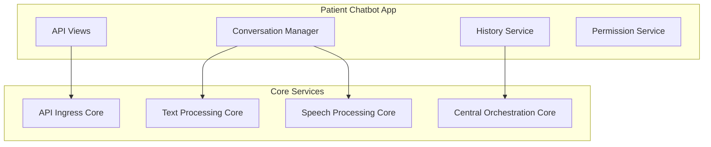

# 🤖 پلن توسعه چت‌بات بیمار HELSSA

## 📋 خلاصه اجرایی

چت‌بات بیمار یک سیستم هوشمند مشاوره پزشکی 24/7 است که با استفاده از GPT-4 و قابلیت‌های صوتی (STT/TTS) به بیماران در تشخیص اولیه، راهنمایی پزشکی و ارجاع به پزشک مناسب کمک می‌کند.

## 🎯 اهداف

1. **مشاوره پزشکی 24/7**: پاسخ به سوالات پزشکی با دقت بالا
2. **تشخیص اولیه**: ارزیابی علائم و ارائه توصیه‌های اولیه
3. **ارجاع هوشمند**: معرفی پزشک مناسب بر اساس علائم
4. **پشتیبانی چندزبانه**: فارسی، انگلیسی، عربی
5. **یکپارچگی صوتی**: پشتیبانی از ورودی/خروجی صوتی

## 🏗️ معماری

### اتصال به هسته‌ها



### کامپوننت‌های اصلی

1. **Conversation Manager**: مدیریت مکالمات و context
2. **Symptom Analyzer**: تحلیل علائم بیان شده
3. **Medical Knowledge Base**: پایگاه دانش پزشکی
4. **Doctor Recommender**: سیستم توصیه پزشک
5. **History Service**: ذخیره و بازیابی تاریخچه

## 📁 ساختار پروژه

```
patient_chatbot/
├── models/
│   ├── __init__.py
│   ├── conversation.py      # مدل مکالمه
│   ├── message.py          # مدل پیام
│   ├── symptom.py          # مدل علائم
│   └── recommendation.py   # مدل توصیه‌ها
├── services/
│   ├── __init__.py
│   ├── conversation_service.py
│   ├── symptom_analyzer.py
│   ├── medical_kb_service.py
│   ├── doctor_recommender.py
│   └── history_service.py
├── api/
│   ├── __init__.py
│   ├── serializers.py
│   └── views.py
├── agents/
│   ├── __init__.py
│   ├── medical_agent.py    # OpenAI Agent
│   └── triage_agent.py     # Triage Agent
├── utils/
│   ├── __init__.py
│   ├── medical_terms.py
│   └── validators.py
├── tasks.py
├── tests/
│   ├── __init__.py
│   ├── test_models.py
│   ├── test_services.py
│   └── test_api.py
├── migrations/
├── apps.py
└── README.md
```

## 🔌 API Endpoints

### چت اصلی

```
POST /api/v1/patients/chat/start/
POST /api/v1/patients/chat/{session_id}/message/
GET  /api/v1/patients/chat/{session_id}/history/
POST /api/v1/patients/chat/{session_id}/end/
```

### صوت

```
POST /api/v1/patients/chat/{session_id}/voice/upload/
GET  /api/v1/patients/chat/{session_id}/voice/response/
```

### توصیه‌ها

```
GET  /api/v1/patients/chat/{session_id}/recommendations/
GET  /api/v1/patients/doctors/recommended/
```

## 🔒 امنیت

### احراز هویت

- **روش**: JWT Token با OTP
- **نقش مورد نیاز**: `patient`
- **Session Management**: Redis-based

### محدودیت‌ها

```python
RATE_LIMITS = {
    'chat_message': '30/minute',
    'voice_upload': '10/minute',
    'new_session': '5/hour'
}
```

### Privacy

- رمزنگاری End-to-End برای پیام‌های حساس
- عدم ذخیره اطلاعات پزشکی حساس در لاگ‌ها
- Anonymization برای آنالیز و بهبود

## 🧩 وابستگی‌ها

### هسته‌های داخلی

- `unified_auth`: احراز هویت کاربران
- `unified_billing`: بررسی اشتراک و محدودیت‌ها
- `unified_ai`: دسترسی به GPT-4

### سرویس‌های خارجی

- **OpenAI GPT-4**: مدل زبانی اصلی
- **Whisper API**: تبدیل گفتار به متن
- **Google TTS**: تبدیل متن به گفتار

## 📊 مدل‌های داده

### Conversation Model

```python
class Conversation(models.Model):
    id = models.UUIDField(primary_key=True)
    patient = models.ForeignKey('unified_auth.UnifiedUser')
    started_at = models.DateTimeField(auto_now_add=True)
    ended_at = models.DateTimeField(null=True)
    status = models.CharField(choices=CONVERSATION_STATES)
    chief_complaint = models.TextField()
    triage_level = models.IntegerField(null=True)
    recommended_doctor = models.ForeignKey('doctors.Doctor', null=True)
```

### Message Model

```python
class Message(models.Model):
    conversation = models.ForeignKey(Conversation)
    sender_type = models.CharField(choices=['patient', 'assistant'])
    content = models.TextField()
    voice_url = models.URLField(null=True)
    metadata = models.JSONField(default=dict)
    created_at = models.DateTimeField(auto_now_add=True)
```

## 🎯 KPIs و متریک‌ها

1. **Response Time**: < 2 ثانیه برای پیام متنی
2. **Accuracy**: > 85% در تشخیص اولیه
3. **User Satisfaction**: > 4.5/5
4. **Session Completion**: > 70%
5. **Doctor Referral Rate**: 30-40%

## 🚀 مراحل پیاده‌سازی

### فاز 1: پایه (هفته 1)
- [ ] ایجاد مدل‌های داده
- [ ] پیاده‌سازی Conversation Service
- [ ] اتصال به OpenAI GPT-4
- [ ] API های پایه

### فاز 2: قابلیت‌های پیشرفته (هفته 2)
- [ ] Symptom Analyzer
- [ ] Medical Knowledge Base
- [ ] Doctor Recommender
- [ ] تاریخچه و گزارش‌گیری

### فاز 3: صوت و بهینه‌سازی (هفته 3)
- [ ] یکپارچگی Whisper
- [ ] پیاده‌سازی TTS
- [ ] بهینه‌سازی عملکرد
- [ ] تست‌های کامل

## 📈 مشاهده‌پذیری

### Logging

```python
LOGGING_EVENTS = [
    'conversation_started',
    'message_sent',
    'symptom_detected',
    'doctor_recommended',
    'conversation_ended',
    'error_occurred'
]
```

### Metrics

- تعداد مکالمات روزانه
- میانگین طول مکالمه
- نرخ تکمیل session
- توزیع تشخیص‌ها
- رضایت کاربران

## 🔄 CI/CD

### Pre-deployment Checklist

1. [ ] تست‌های واحد (coverage > 80%)
2. [ ] تست‌های یکپارچگی
3. [ ] بررسی امنیتی
4. [ ] Performance benchmarks
5. [ ] مستندسازی API

### Deployment Strategy

- **Stage 1**: Canary deployment (5%)
- **Stage 2**: Gradual rollout (25%, 50%, 100%)
- **Rollback**: Automatic on error rate > 5%

---

**نکته مهم**: این پلن باید بدون هیچ تغییری توسط ایجنت مربوطه اجرا شود. هرگونه انحراف باید در LOG.md ثبت و دلیل آن توضیح داده شود.


another version for choose better
# patient_chatbot - برنامه پیاده‌سازی

## هدف و دامنه

### هدف کلی
ایجاد سیستم چت‌بات هوشمند برای بیماران با قابلیت پاسخ‌گویی به سؤالات پزشکی، راهنمایی اولیه و ارجاع به پزشک در صورت نیاز.

### دامنه عملکرد
- چت متنی با AI پزشکی
- تاریخچه گفتگوها
- اشتراک‌گذاری گفتگو با پزشک
- تولید خلاصه گفتگو
- راهنمایی برای مراجعه به پزشک
- پیشنهاد تست‌های اولیه

### مصرف‌کنندگان هدف
- **بیماران**: چت با AI، مشاهده تاریخچه، اشتراک‌گذاری با پزشک
- **پزشکان**: مشاهده گفتگوهای اشتراک شده، تحلیل وضعیت بیمار

## معماری کلی

### ادغام با هسته‌های مرکزی

#### 1. هسته‌ی ورودی API (API Ingress Core)
- **Endpoints**: 
  - `POST /api/patient-chatbot/chat/` - ارسال پیام
  - `GET /api/patient-chatbot/history/` - تاریخچه گفتگوها
  - `GET /api/patient-chatbot/sessions/` - لیست sessions
  - `POST /api/patient-chatbot/share/` - اشتراک‌گذاری با پزشک
  - `GET /api/patient-chatbot/health/` - health check
- **Authentication**: Unified Auth با JWT - فقط patient
- **Validation**: 
  - محدودیت طول پیام (حداکثر 1000 کاراکتر)
  - فیلتر کلمات نامناسب
  - بررسی rate limiting
- **Rate Limiting**: 20 پیام در دقیقه، 500 پیام در روز

#### 2. هسته‌ی پردازش متن (Text Processing Core)
- **AI Integration**: یکپارچه‌سازی با unified_ai
- **NLP Tasks**: 
  - تشخیص intent پیام
  - استخراج علائم و نشانه‌ها
  - تولید پاسخ متناسب
  - خلاصه‌سازی گفتگو
- **Language Support**: فارسی (اصلی)، انگلیسی

#### 3. هسته‌ی پردازش صوت (Speech Processing Core)
- این اپ از پردازش صوت استفاده نمی‌کند

#### 4. هسته‌ی ارکستراسیون مرکزی (Central Orchestration Core)
- **Workflows**: 
  - patient_chat_flow: پردازش پیام بیمار
  - session_management: مدیریت sessions
  - share_with_doctor: اشتراک‌گذاری با پزشک
  - emergency_detection: تشخیص وضعیت اورژانس
- **Business Logic**: 
  - محدودیت‌های اشتراک
  - اولویت‌بندی پیام‌ها
  - تشخیص نیاز به پزشک
- **Background Tasks**: 
  - cleanup_old_sessions: پاکسازی session های قدیمی
  - generate_summaries: تولید خلاصه گفتگوها

## API سطح بالا

### Endpoints بیمار (Patient)
```
POST /api/patient-chatbot/chat/
{
  "message": "سلام، سر درد دارم",
  "session_id": "uuid-optional"
}
Response: {
  "response": "سلام. لطفاً بیشتر توضیح دهید...",
  "session_id": "uuid",
  "suggestions": ["مراجعه به پزشک", "استراحت"],
  "urgency_level": "low"
}

GET /api/patient-chatbot/history/?page=1&limit=10
Response: {
  "sessions": [
    {
      "id": "uuid",
      "title": "سر درد و تب",
      "started_at": "2024-01-01T10:00:00Z",
      "message_count": 15,
      "summary": "مشاوره درباره سر درد...",
      "urgency_level": "medium"
    }
  ],
  "pagination": {...}
}

POST /api/patient-chatbot/share/
{
  "session_id": "uuid",
  "doctor_id": 123,
  "message": "لطفاً نظر بدهید"
}
```

### Endpoints پزشک (Doctor)
```
GET /api/patient-chatbot/shared-chats/
Response: {
  "chats": [
    {
      "patient_name": "نام بیمار",
      "session_id": "uuid", 
      "shared_at": "2024-01-01T10:00:00Z",
      "urgency_level": "high",
      "summary": "خلاصه گفتگو..."
    }
  ]
}

GET /api/patient-chatbot/session/{session_id}/
Response: {
  "messages": [...],
  "patient_info": {...},
  "ai_analysis": {...}
}
```

### Endpoints مشترک
```
GET /api/patient-chatbot/health/
Response: {"status": "healthy", "ai_service": "available"}
```

## وابستگی‌ها

### هسته‌های داخلی
- `unified_auth`: احراز هویت و مدیریت کاربران
- `unified_billing`: بررسی محدودیت‌های اشتراک
- `unified_access`: دسترسی موقت پزشک به گفتگوها
- `unified_ai`: سرویس‌های هوش مصنوعی

### کتابخانه‌های خارجی
- `openai>=1.3.0`: برای AI integration
- `celery>=5.3.0`: برای background tasks
- `redis>=4.5.0`: برای cache و rate limiting
- `django-filter>=23.1`: برای فیلترینگ API

## مدل‌های داده

### مدل‌های اصلی
```python
class ChatSession(models.Model):
    """جلسه چت بیمار"""
    id = models.UUIDField(primary_key=True, default=uuid.uuid4)
    patient = models.ForeignKey(UnifiedUser, on_delete=models.CASCADE)
    title = models.CharField(max_length=200, blank=True)
    started_at = models.DateTimeField(auto_now_add=True)
    ended_at = models.DateTimeField(null=True, blank=True)
    is_active = models.BooleanField(default=True)
    urgency_level = models.CharField(max_length=20, choices=URGENCY_CHOICES)
    summary = models.TextField(blank=True)
    ai_analysis = models.JSONField(default=dict)

class ChatMessage(models.Model):
    """پیام در جلسه چت"""
    session = models.ForeignKey(ChatSession, on_delete=models.CASCADE)
    is_bot = models.BooleanField(default=False)
    message = models.TextField()
    timestamp = models.DateTimeField(auto_now_add=True)
    metadata = models.JSONField(default=dict)  # intent, entities, etc.

class SharedChat(models.Model):
    """اشتراک‌گذاری گفتگو با پزشک"""
    session = models.ForeignKey(ChatSession, on_delete=models.CASCADE)
    doctor = models.ForeignKey(UnifiedUser, on_delete=models.CASCADE)
    shared_at = models.DateTimeField(auto_now_add=True)
    patient_message = models.TextField(blank=True)
    doctor_response = models.TextField(blank=True)
    status = models.CharField(max_length=20, choices=SHARE_STATUS_CHOICES)
```

### روابط با سیستم‌های موجود
- `UnifiedUser`: رابطه با بیمار و پزشک
- `UnifiedAIChat`: sync با unified_ai برای ذخیره‌سازی
- `AccessSession`: برای دسترسی موقت پزشک

## امنیت و دسترسی

### احراز هویت
- **روش ورود**: OTP از طریق Kavenegar
- **نگهداری session**: JWT tokens
- **انقضای token**: Access 5 دقیقه، Refresh 7 روز

### سطوح دسترسی
- **بیمار**: 
  - ایجاد و مدیریت session های خود
  - اشتراک‌گذاری با پزشک انتخابی
  - مشاهده تاریخچه خود
- **پزشک**: 
  - مشاهده گفتگوهای اشتراک شده
  - پاسخ به سؤالات بیماران
  - دسترسی با کد موقت بیمار
- **مدیر**: 
  - مشاهده آمار کلی
  - مدیریت AI prompts

### حفاظت از داده‌ها
- **رمزنگاری**: پیام‌های حساس رمزنگاری شده ذخیره می‌شوند
- **Audit Logging**: تمام دسترسی‌های پزشک ثبت می‌شود
- **Rate Limiting**: 20 پیام/دقیقه، 500 پیام/روز برای هر بیمار

### سیاست‌های OTP
- **مدت اعتبار**: 3 دقیقه
- **تعداد تلاش**: حداکثر 3 بار
- **محدودیت ارسال**: 1 در دقیقه، 5 در ساعت
- **Provider**: Kavenegar SMS service

## مشاهده‌پذیری

### لاگ‌گذاری
- **سطح**: INFO برای عملیات عادی، ERROR برای خطاها
- **فرمت**: JSON structured logs
- **محتوا**: 
  - user_id, session_id, message_length
  - ai_response_time, intent_detected
  - urgency_level, error_details

### Metrics
- **Performance**: Response time, AI processing time
- **Business**: 
  - تعداد session های روزانه
  - میانگین طول گفتگو
  - نرخ اشتراک‌گذاری با پزشک
  - توزیع urgency levels
- **Error Rate**: خطاهای AI، timeout ها

### Monitoring
- **Health Checks**: 
  - `/api/patient-chatbot/health/`
  - بررسی اتصال به unified_ai
  - بررسی Redis cache
- **Alerts**: 
  - AI response time > 10 ثانیه
  - Error rate > 5%
  - High urgency messages

## تست‌ها

### تست‌های واحد (Unit Tests)
- **Coverage Target**: حداقل 90%
- **Test Files**: 
  - `test_models.py`: تست مدل‌ها
  - `test_views.py`: تست API endpoints
  - `test_text_processor.py`: تست پردازش متن
  - `test_orchestrator.py`: تست workflows

### تست‌های تلفیقی (Integration Tests)
- **API Tests**: 
  - تست کامل flow چت
  - تست اشتراک‌گذاری با پزشک
  - تست rate limiting
- **Database Tests**: 
  - تست concurrent sessions
  - تست data integrity

### تست‌های End-to-End
- **User Journeys**: 
  - بیمار ایجاد session جدید
  - چت کامل با AI
  - اشتراک‌گذاری با پزشک
  - پزشک پاسخ می‌دهد

## انتشار

### متغیرهای محیطی
```bash
CHATBOT_MAX_MESSAGE_LENGTH=1000
CHATBOT_DAILY_LIMIT=500
CHATBOT_RATE_LIMIT=20
AI_PROMPT_TEMPLATE="system_prompt_here"
REDIS_URL=redis://127.0.0.1:6379/1
```

### تنظیمات Django
```python
INSTALLED_APPS += ['patient_chatbot.apps.PatientChatbotConfig']

PATIENT_CHATBOT_SETTINGS = {
    'MAX_MESSAGE_LENGTH': 1000,
    'DAILY_LIMIT': 500,
    'RATE_LIMIT': 20,
    'AI_MODEL': 'gpt-4',
    'ENABLE_URGENCY_DETECTION': True,
}

CELERY_BEAT_SCHEDULE.update({
    'cleanup-old-sessions': {
        'task': 'patient_chatbot.tasks.cleanup_old_sessions',
        'schedule': crontab(hour=2, minute=0),  # 2 AM daily
    },
})
```

### URL Routing
```python
urlpatterns += [
    path('api/patient-chatbot/', include('patient_chatbot.urls')),
]
```

## داشبورد پزشک

### ویژگی‌های اختصاصی
- **صف گفتگوهای اشتراک شده**: با اولویت‌بندی urgency
- **فیلتر بر اساس urgency**: high, medium, low
- **جستجو در گفتگوها**: بر اساس علائم یا کلمات کلیدی
- **آمار شخصی**: تعداد مشاوره‌ها، رضایت بیماران

### گزارش‌ها
- **گزارش روزانه**: تعداد گفتگوهای جدید
- **گزارش علائم**: پراکندگی علائم گزارش شده
- **گزارش رضایت**: feedback بیماران

### مدیریت صف
- **اولویت‌بندی**: high urgency در ابتدای صف
- **تخصیص خودکار**: بر اساس تخصص پزشک
- **نوتیفیکیشن**: اطلاع‌رسانی گفتگوهای جدید

## یکپارچگی با پرداخت

### درگاه‌های پرداخت
- رایگان برای استفاده پایه (20 پیام/روز)
- اشتراک برای استفاده نامحدود
- پرداخت per-consultation برای مشاوره‌های تخصصی

### مدیریت کیف پول
- کسر از کیف پول برای مشاوره‌های پولی
- شارژ خودکار در صورت کمبود موجودی

### سیاست‌های قیمت‌گذاری
- مشاوره پایه AI: رایگان
- مشاوره تخصصی: 50,000 تومان
- اشتراک ماهانه: 200,000 تومان

## یکپارچگی با پیام‌رسانی

### Kavenegar SMS
- **API Key**: تنظیم در `KAVENEGAR_API_KEY`
- **Templates**: 
  - `urgent_consultation`: برای مشاوره‌های اورژانس
  - `doctor_response`: اطلاع از پاسخ پزشک
- **Error Handling**: retry mechanism برای خطاهای ارسال

### اطلاع‌رسانی‌ها
- **بیمار**: پاسخ پزشک، یادآوری follow-up
- **پزشک**: گفتگوی جدید high urgency

## مراحل پیاده‌سازی

### فاز 1: ساختار پایه (هفته 1)
- [x] ایجاد Django app
- [ ] تعریف models
- [ ] پیکربندی admin
- [ ] ایجاد migrations

### فاز 2: API و هسته‌ها (هفته 2)
- [ ] پیاده‌سازی چهار هسته
- [ ] ایجاد serializers
- [ ] پیاده‌سازی views
- [ ] پیکربندی URLs

### فاز 3: امنیت و دسترسی (هفته 3)
- [ ] ادغام با unified_auth
- [ ] پیاده‌سازی permissions
- [ ] تست‌های امنیتی

### فاز 4: تست و مستندسازی (هفته 4)
- [ ] نوشتن تست‌ها
- [ ] تکمیل مستندات
- [ ] بررسی coverage

### فاز 5: آماده‌سازی انتشار (هفته 5)
- [ ] تنظیمات production
- [ ] Performance optimization
- [ ] Security audit

## ملاحظات خاص

### AI Safety
- فیلتر محتوای نامناسب در prompt
- عدم ارائه تشخیص قطعی پزشکی
- ارجاع به پزشک در موارد جدی

### Privacy
- عدم ذخیره اطلاعات شخصی حساس
- رمزنگاری پیام‌های درمانی
- حق حذف داده‌ها (GDPR compliance)

### Performance
- Cache پاسخ‌های متداول AI
- Pagination برای تاریخچه طولانی
- Async processing برای AI calls

## نکات مهم

1. **عدم استثناء**: هیچ عمل سلیقه‌ای مجاز نیست
2. **دستورالعمل‌محوری**: فقط طبق این سند عمل شود
3. **ثبت تغییرات**: هر انحراف در LOG.md ثبت شود
4. **تست‌ها**: نوشته شوند اما اجرا نشوند
5. **مستندسازی**: تمام تغییرات در README مستند شوند

---
**نسخه**: 1.0.0
**تاریخ ایجاد**: 2024-12-19
**آخرین به‌روزرسانی**: 2024-12-19