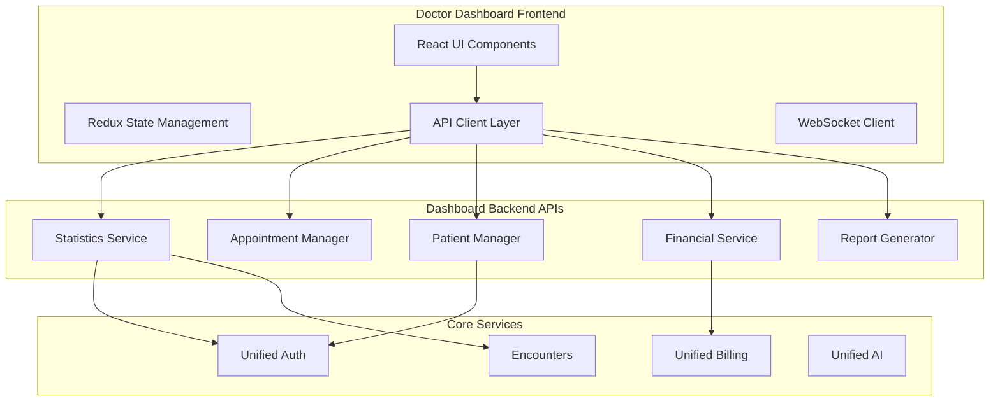

# 📊 پلن توسعه داشبورد پزشک HELSSA

## 📋 خلاصه اجرایی

داشبورد پزشک یک رابط کاربری جامع و اختصاصی برای پزشکان است که امکان مدیریت ویزیت‌ها، بررسی آمار و گزارش‌ها، مدیریت بیماران، تنظیمات مالی و دسترسی به ابزارهای تخصصی را فراهم می‌کند. این داشبورد با طراحی مدرن و کاربرپسند، تجربه کاری پزشکان را بهینه می‌سازد.

## 🎯 اهداف

1. **مدیریت یکپارچه**: تمام ابزارهای مورد نیاز پزشک در یک مکان
2. **دید کلی لحظه‌ای**: آمار و وضعیت real-time
3. **مدیریت بیماران**: دسترسی سریع به پرونده‌ها و تاریخچه
4. **گزارش‌گیری پیشرفته**: تحلیل عملکرد و درآمد
5. **تنظیمات شخصی‌سازی**: پروفایل و ترجیحات پزشک

## 🏗️ معماری

### اتصال به هسته‌ها و سرویس‌ها



### کامپوننت‌های اصلی

1. **Overview Dashboard**: نمای کلی و آمار
2. **Appointment Manager**: مدیریت نوبت‌ها
3. **Patient Directory**: لیست و جستجوی بیماران
4. **Financial Dashboard**: درآمد و تراکنش‌ها
5. **Analytics Center**: گزارش‌ها و تحلیل‌ها
6. **Profile Settings**: تنظیمات پروفایل

## 📁 ساختار پروژه

```
doctor_dashboard/
├── models/
│   ├── __init__.py
│   ├── dashboard_config.py   # تنظیمات داشبورد
│   ├── widget.py            # ویجت‌های قابل تنظیم
│   ├── report_template.py   # قالب‌های گزارش
│   └── notification_pref.py # ترجیحات اعلان
├── services/
│   ├── __init__.py
│   ├── statistics_service.py
│   ├── appointment_service.py
│   ├── patient_service.py
│   ├── financial_service.py
│   ├── report_service.py
│   └── notification_service.py
├── api/
│   ├── __init__.py
│   ├── serializers.py
│   ├── views.py
│   └── permissions.py
├── frontend/
│   ├── components/
│   │   ├── Overview/
│   │   ├── Appointments/
│   │   ├── Patients/
│   │   ├── Financial/
│   │   ├── Analytics/
│   │   └── Settings/
│   ├── store/            # Redux store
│   ├── services/         # API services
│   ├── hooks/           # Custom React hooks
│   └── utils/
├── tasks.py
├── tests/
│   ├── __init__.py
│   ├── test_services.py
│   ├── test_api.py
│   └── test_frontend.py
├── migrations/
├── apps.py
└── README.md
```

## 🔌 API Endpoints

### داشبورد و آمار

```
GET  /api/v1/doctors/dashboard/overview/
GET  /api/v1/doctors/dashboard/stats/today/
GET  /api/v1/doctors/dashboard/stats/week/
GET  /api/v1/doctors/dashboard/stats/month/
POST /api/v1/doctors/dashboard/widgets/customize/
```

### مدیریت نوبت‌ها

```
GET  /api/v1/doctors/appointments/
GET  /api/v1/doctors/appointments/today/
GET  /api/v1/doctors/appointments/upcoming/
POST /api/v1/doctors/appointments/{id}/status/
GET  /api/v1/doctors/appointments/calendar/
```

### مدیریت بیماران

```
GET  /api/v1/doctors/patients/
GET  /api/v1/doctors/patients/{id}/profile/
GET  /api/v1/doctors/patients/{id}/history/
GET  /api/v1/doctors/patients/{id}/documents/
POST /api/v1/doctors/patients/{id}/note/
```

### امور مالی

```
GET  /api/v1/doctors/financial/summary/
GET  /api/v1/doctors/financial/transactions/
GET  /api/v1/doctors/financial/earnings/
GET  /api/v1/doctors/financial/commissions/
POST /api/v1/doctors/financial/withdraw/
```

### گزارش‌گیری و تحلیل

```
GET  /api/v1/doctors/analytics/performance/
GET  /api/v1/doctors/analytics/patient-satisfaction/
GET  /api/v1/doctors/analytics/appointment-trends/
POST /api/v1/doctors/reports/generate/
GET  /api/v1/doctors/reports/templates/
```

### تنظیمات و پروفایل

```
GET  /api/v1/doctors/profile/
PATCH /api/v1/doctors/profile/update/
POST /api/v1/doctors/profile/availability/
GET  /api/v1/doctors/settings/notifications/
PATCH /api/v1/doctors/settings/preferences/
```

## 🎨 طراحی UI/UX

### اصول طراحی

1. **Clean & Modern**: طراحی مینیمال و حرفه‌ای
2. **Responsive**: سازگار با تمام دستگاه‌ها
3. **Dark Mode**: پشتیبانی از حالت تاریک
4. **RTL Support**: پشتیبانی کامل از راست به چپ
5. **Accessibility**: رعایت استانداردهای دسترسی

### صفحات اصلی

#### 1. Overview Page
```jsx
// components/Overview/OverviewDashboard.jsx
- Today's Summary Card
- Upcoming Appointments Widget
- Recent Patients List
- Revenue Chart
- Quick Actions Panel
```

#### 2. Appointments Page
```jsx
// components/Appointments/AppointmentManager.jsx
- Calendar View
- List View
- Appointment Details Modal
- Status Management
- Reschedule Interface
```

#### 3. Patients Page
```jsx
// components/Patients/PatientDirectory.jsx
- Search & Filter Bar
- Patient Cards/List
- Patient Profile View
- Medical History Timeline
- Document Manager
```

#### 4. Financial Page
```jsx
// components/Financial/FinancialDashboard.jsx
- Earnings Overview
- Transaction History
- Commission Breakdown
- Withdrawal Interface
- Financial Reports
```

#### 5. Analytics Page
```jsx
// components/Analytics/AnalyticsCenter.jsx
- Performance Metrics
- Patient Satisfaction Charts
- Appointment Analytics
- Custom Report Builder
- Export Options
```

## 🔒 امنیت و دسترسی

### احراز هویت

- **روش**: JWT Token با OTP
- **نقش مورد نیاز**: `doctor`
- **Session Management**: Secure & persistent

### سطوح دسترسی

```python
DASHBOARD_PERMISSIONS = {
    'view_own_data': True,
    'view_patient_data': 'with_consent',
    'modify_appointments': True,
    'access_financial': True,
    'generate_reports': True,
    'export_data': 'limited'
}
```

### Privacy Controls

- عدم نمایش اطلاعات حساس بیماران بدون consent
- ماسک کردن اطلاعات مالی در screenshots
- Activity logging برای audit trail

## 📊 مدل‌های داده

### DashboardConfig Model

```python
class DashboardConfig(models.Model):
    doctor = models.OneToOneField('unified_auth.UnifiedUser')
    theme = models.CharField(choices=['light', 'dark', 'auto'])
    language = models.CharField(default='fa')
    timezone = models.CharField(default='Asia/Tehran')
    widgets_order = models.JSONField(default=list)
    quick_actions = models.JSONField(default=list)
    notification_preferences = models.JSONField(default=dict)
```

### DashboardWidget Model

```python
class DashboardWidget(models.Model):
    name = models.CharField(max_length=50)
    widget_type = models.CharField(choices=WIDGET_TYPES)
    config = models.JSONField(default=dict)
    is_default = models.BooleanField(default=False)
    min_width = models.IntegerField(default=1)
    min_height = models.IntegerField(default=1)
```

## 🎯 KPIs و متریک‌ها

1. **Page Load Time**: < 1.5 ثانیه
2. **API Response Time**: < 200ms (P95)
3. **User Engagement**: > 80% daily active
4. **Feature Adoption**: > 60% برای features جدید
5. **Error Rate**: < 0.1%

## 🚀 مراحل پیاده‌سازی

### فاز 1: Backend APIs (هفته 1)
- [ ] ایجاد مدل‌ها و services
- [ ] API endpoints اصلی
- [ ] Statistics aggregation
- [ ] Permission system

### فاز 2: Frontend Foundation (هفته 2)
- [ ] React setup با TypeScript
- [ ] Redux store configuration
- [ ] Component architecture
- [ ] API integration layer

### فاز 3: Core Features (هفته 3)
- [ ] Overview dashboard
- [ ] Appointment management
- [ ] Patient directory
- [ ] Basic analytics

### فاز 4: Advanced Features (هفته 4)
- [ ] Financial dashboard
- [ ] Advanced analytics
- [ ] Report generation
- [ ] Customization options

## 📈 مشاهده‌پذیری

### Frontend Monitoring

```javascript
// Sentry integration
Sentry.init({
  dsn: process.env.REACT_APP_SENTRY_DSN,
  environment: process.env.NODE_ENV,
  tracesSampleRate: 0.1,
});

// Performance monitoring
const vitals = {
  FCP: 'First Contentful Paint',
  LCP: 'Largest Contentful Paint',
  CLS: 'Cumulative Layout Shift',
  FID: 'First Input Delay'
};
```

### Backend Metrics

```python
DASHBOARD_METRICS = [
    'api_response_time',
    'active_users_count',
    'feature_usage_rate',
    'error_rate',
    'data_fetch_time'
]
```

## 🔄 CI/CD

### Build Process

```yaml
# Frontend build
- npm install
- npm run test
- npm run build
- Deploy to CDN

# Backend deployment
- Run migrations
- Collect static files
- Deploy API
- Cache warming
```

### Testing Strategy

1. **Unit Tests**: Components & Services
2. **Integration Tests**: API endpoints
3. **E2E Tests**: Critical user flows
4. **Performance Tests**: Load testing
5. **Accessibility Tests**: WCAG compliance

---

**نکته مهم**: داشبورد پزشک چهره اصلی تعامل پزشکان با سیستم است. کیفیت UI/UX، سرعت و قابلیت اطمینان در اولویت قرار دارند. طراحی باید حرفه‌ای، کاربرپسند و متناسب با نیازهای پزشکان ایرانی باشد.