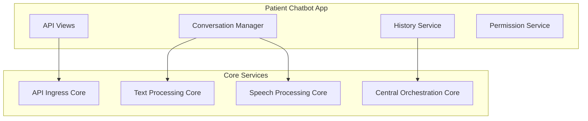

# 🤖 پلن توسعه چت‌بات بیمار HELSSA

## 📋 خلاصه اجرایی

چت‌بات بیمار یک سیستم هوشمند مشاوره پزشکی 24/7 است که با استفاده از GPT-4 و قابلیت‌های صوتی (STT/TTS) به بیماران در تشخیص اولیه، راهنمایی پزشکی و ارجاع به پزشک مناسب کمک می‌کند.

## 🎯 اهداف

1. **مشاوره پزشکی 24/7**: پاسخ به سوالات پزشکی با دقت بالا
2. **تشخیص اولیه**: ارزیابی علائم و ارائه توصیه‌های اولیه
3. **ارجاع هوشمند**: معرفی پزشک مناسب بر اساس علائم
4. **پشتیبانی چندزبانه**: فارسی، انگلیسی، عربی
5. **یکپارچگی صوتی**: پشتیبانی از ورودی/خروجی صوتی

## 🏗️ معماری

### اتصال به هسته‌ها



### کامپوننت‌های اصلی

1. **Conversation Manager**: مدیریت مکالمات و context
2. **Symptom Analyzer**: تحلیل علائم بیان شده
3. **Medical Knowledge Base**: پایگاه دانش پزشکی
4. **Doctor Recommender**: سیستم توصیه پزشک
5. **History Service**: ذخیره و بازیابی تاریخچه

## 📁 ساختار پروژه

```
patient_chatbot/
├── models/
│   ├── __init__.py
│   ├── conversation.py      # مدل مکالمه
│   ├── message.py          # مدل پیام
│   ├── symptom.py          # مدل علائم
│   └── recommendation.py   # مدل توصیه‌ها
├── services/
│   ├── __init__.py
│   ├── conversation_service.py
│   ├── symptom_analyzer.py
│   ├── medical_kb_service.py
│   ├── doctor_recommender.py
│   └── history_service.py
├── api/
│   ├── __init__.py
│   ├── serializers.py
│   └── views.py
├── agents/
│   ├── __init__.py
│   ├── medical_agent.py    # OpenAI Agent
│   └── triage_agent.py     # Triage Agent
├── utils/
│   ├── __init__.py
│   ├── medical_terms.py
│   └── validators.py
├── tasks.py
├── tests/
│   ├── __init__.py
│   ├── test_models.py
│   ├── test_services.py
│   └── test_api.py
├── migrations/
├── apps.py
└── README.md
```

## 🔌 API Endpoints

### چت اصلی

```
POST /api/v1/patients/chat/start/
POST /api/v1/patients/chat/{session_id}/message/
GET  /api/v1/patients/chat/{session_id}/history/
POST /api/v1/patients/chat/{session_id}/end/
```

### صوت

```
POST /api/v1/patients/chat/{session_id}/voice/upload/
GET  /api/v1/patients/chat/{session_id}/voice/response/
```

### توصیه‌ها

```
GET  /api/v1/patients/chat/{session_id}/recommendations/
GET  /api/v1/patients/doctors/recommended/
```

## 🔒 امنیت

### احراز هویت

- **روش**: JWT Token با OTP
- **نقش مورد نیاز**: `patient`
- **Session Management**: Redis-based

### محدودیت‌ها

```python
RATE_LIMITS = {
    'chat_message': '30/minute',
    'voice_upload': '10/minute',
    'new_session': '5/hour'
}
```

### Privacy

- رمزنگاری End-to-End برای پیام‌های حساس
- عدم ذخیره اطلاعات پزشکی حساس در لاگ‌ها
- Anonymization برای آنالیز و بهبود

## 🧩 وابستگی‌ها

### هسته‌های داخلی

- `unified_auth`: احراز هویت کاربران
- `unified_billing`: بررسی اشتراک و محدودیت‌ها
- `unified_ai`: دسترسی به GPT-4

### سرویس‌های خارجی

- **OpenAI GPT-4**: مدل زبانی اصلی
- **Whisper API**: تبدیل گفتار به متن
- **Google TTS**: تبدیل متن به گفتار

## 📊 مدل‌های داده

### Conversation Model

```python
class Conversation(models.Model):
    id = models.UUIDField(primary_key=True)
    patient = models.ForeignKey('unified_auth.UnifiedUser')
    started_at = models.DateTimeField(auto_now_add=True)
    ended_at = models.DateTimeField(null=True)
    status = models.CharField(choices=CONVERSATION_STATES)
    chief_complaint = models.TextField()
    triage_level = models.IntegerField(null=True)
    recommended_doctor = models.ForeignKey('doctors.Doctor', null=True)
```

### Message Model

```python
class Message(models.Model):
    conversation = models.ForeignKey(Conversation)
    sender_type = models.CharField(choices=['patient', 'assistant'])
    content = models.TextField()
    voice_url = models.URLField(null=True)
    metadata = models.JSONField(default=dict)
    created_at = models.DateTimeField(auto_now_add=True)
```

## 🎯 KPIs و متریک‌ها

1. **Response Time**: < 2 ثانیه برای پیام متنی
2. **Accuracy**: > 85% در تشخیص اولیه
3. **User Satisfaction**: > 4.5/5
4. **Session Completion**: > 70%
5. **Doctor Referral Rate**: 30-40%

## 🚀 مراحل پیاده‌سازی

### فاز 1: پایه (هفته 1)
- [ ] ایجاد مدل‌های داده
- [ ] پیاده‌سازی Conversation Service
- [ ] اتصال به OpenAI GPT-4
- [ ] API های پایه

### فاز 2: قابلیت‌های پیشرفته (هفته 2)
- [ ] Symptom Analyzer
- [ ] Medical Knowledge Base
- [ ] Doctor Recommender
- [ ] تاریخچه و گزارش‌گیری

### فاز 3: صوت و بهینه‌سازی (هفته 3)
- [ ] یکپارچگی Whisper
- [ ] پیاده‌سازی TTS
- [ ] بهینه‌سازی عملکرد
- [ ] تست‌های کامل

## 📈 مشاهده‌پذیری

### Logging

```python
LOGGING_EVENTS = [
    'conversation_started',
    'message_sent',
    'symptom_detected',
    'doctor_recommended',
    'conversation_ended',
    'error_occurred'
]
```

### Metrics

- تعداد مکالمات روزانه
- میانگین طول مکالمه
- نرخ تکمیل session
- توزیع تشخیص‌ها
- رضایت کاربران

## 🔄 CI/CD

### Pre-deployment Checklist

1. [ ] تست‌های واحد (coverage > 80%)
2. [ ] تست‌های یکپارچگی
3. [ ] بررسی امنیتی
4. [ ] Performance benchmarks
5. [ ] مستندسازی API

### Deployment Strategy

- **Stage 1**: Canary deployment (5%)
- **Stage 2**: Gradual rollout (25%, 50%, 100%)
- **Rollback**: Automatic on error rate > 5%

---

**نکته مهم**: این پلن باید بدون هیچ تغییری توسط ایجنت مربوطه اجرا شود. هرگونه انحراف باید در LOG.md ثبت و دلیل آن توضیح داده شود.